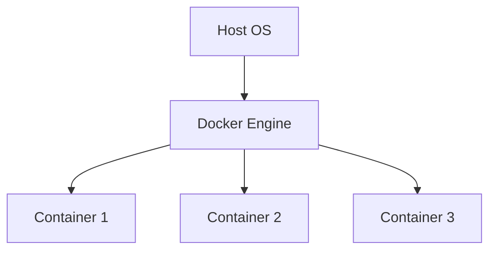

# Learning Guide: Containers (Fundamentals, Linux on Windows, Repositories and Tagging)

- [Learning Guide: Containers (Fundamentals, Linux on Windows, Repositories and Tagging)](#learning-guide-containers-fundamentals-linux-on-windows-repositories-and-tagging)
  - [Introduction](#introduction)
  - [Key Concepts](#key-concepts)
  - [Fundamentals of Containers](#fundamentals-of-containers)
    - [Key Features of Containers](#key-features-of-containers)
  - [Linux on Windows](#linux-on-windows)
    - [Steps to Run Linux Containers on Windows](#steps-to-run-linux-containers-on-windows)
  - [Repositories and Tagging](#repositories-and-tagging)
    - [Key Concepts of Repositories and Tagging](#key-concepts-of-repositories-and-tagging)
  - [Examples](#examples)
    - [Example 1: Creating a Docker Container](#example-1-creating-a-docker-container)
    - [Example 2: Running Linux Containers on Windows](#example-2-running-linux-containers-on-windows)
    - [Example 3: Using Docker Repositories and Tags](#example-3-using-docker-repositories-and-tags)
  - [Advantages](#advantages)
  - [Summary](#summary)

## Introduction

Containers are a lightweight form of virtualization that allow applications to run in isolated environments. This guide covers the fundamentals of containers, running Linux containers on Windows, and using repositories and tagging with practical examples in Docker.

## Key Concepts

- **Container**: A lightweight, standalone, and executable package that includes everything needed to run a piece of software.
- **Docker**: A platform for developing, shipping, and running containers.
- **Image**: A read-only template used to create containers.
- **Repository**: A collection of related Docker images.
- **Tag**: A label applied to a Docker image in a repository.

## Fundamentals of Containers

Containers package an application and its dependencies together, ensuring consistent behavior across different environments. They are built from images, which are created from a set of instructions written in a Dockerfile.

### Key Features of Containers

| **Feature**             | **Description**                                                              |
|-------------------------|------------------------------------------------------------------------------|
| **Isolation**           | Containers run in isolated environments, ensuring no interference between applications. |
| **Portability**         | Containers can run consistently across different environments.                |
| **Efficiency**          | Containers share the host OS kernel, making them more lightweight than virtual machines. |



## Linux on Windows

Running Linux containers on Windows is possible using Docker Desktop, which provides a seamless integration between Linux and Windows environments.

### Steps to Run Linux Containers on Windows

| **Step**                        | **Description**                                         |
|---------------------------------|---------------------------------------------------------|
| **1. Install Docker Desktop**   | Download and install Docker Desktop for Windows.        |
| **2. Enable WSL 2**             | Windows Subsystem for Linux 2 for running Linux binaries. |
| **3. Configure Docker**         | Set Docker to use the WSL 2 based engine.               |
| **4. Run Linux Containers**     | Pull and run Linux containers using Docker commands.    |

## Repositories and Tagging

Docker repositories are used to store and distribute images, while tags are used to identify different versions of an image.

### Key Concepts of Repositories and Tagging

| **Concept**           | **Description**                                             |
|-----------------------|-------------------------------------------------------------|
| **Repository**        | A collection of Docker images.                              |
| **Tag**               | A label applied to an image, often representing a version.  |
| **Docker Hub**        | The default repository used for storing Docker images.      |

## Examples

### Example 1: Creating a Docker Container

```dockerfile
# Use the official Microsoft .NET image
FROM mcr.microsoft.com/dotnet/aspnet:5.0
# Copy the application code to the container
COPY . /app
# Set the working directory
WORKDIR /app
# Run the application
ENTRYPOINT ["dotnet", "myapp.dll"]
```

### Example 2: Running Linux Containers on Windows

```bash
# Pull a Linux-based image
docker pull ubuntu
# Run a Linux container
docker run -it ubuntu bash
```

### Example 3: Using Docker Repositories and Tags

```bash
# Build a Docker image and tag it
docker build -t myapp:1.0 .
# Push the image to Docker Hub
docker tag myapp:1.0 myusername/myapp:1.0
docker push myusername/myapp:1.0
# Pull the image from Docker Hub
docker pull myusername/myapp:1.0
```

## Advantages

- **Consistency**: Ensures that software runs the same regardless of where it is deployed.
- **Efficiency**: More lightweight compared to virtual machines, leading to better resource utilization.
- **Scalability**: Easy to scale applications horizontally by running multiple container instances.

## Summary

Containers provide a powerful way to package, distribute, and run applications in isolated environments. They offer consistency, efficiency, and scalability, making them essential tools in modern software development and deployment.
