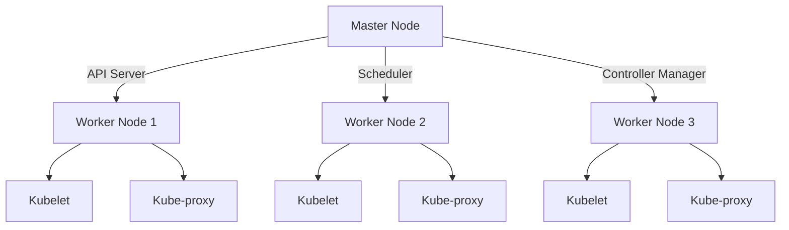

# Learning Guide: Kubernetes (Architecture - K8s Components, Health Checks, Helm)

- [Learning Guide: Kubernetes (Architecture - K8s Components, Health Checks, Helm)](#learning-guide-kubernetes-architecture---k8s-components-health-checks-helm)
  - [Introduction](#introduction)
  - [Key Concepts](#key-concepts)
  - [Kubernetes Architecture](#kubernetes-architecture)
    - [Kubernetes Components](#kubernetes-components)
    - [Health Checks](#health-checks)
    - [Helm](#helm)
  - [Examples](#examples)
    - [Example 1: Basic Kubernetes Deployment](#example-1-basic-kubernetes-deployment)
    - [Example 2: Implementing Health Checks](#example-2-implementing-health-checks)
    - [Example 3: Using Helm for Application Deployment](#example-3-using-helm-for-application-deployment)
  - [Advantages](#advantages)
  - [Summary](#summary)

## Introduction

Kubernetes (K8s) is an open-source platform designed to automate deploying, scaling, and operating application containers. Understanding its architecture and components, along with health checks and Helm, is crucial for efficient container orchestration and management.

## Key Concepts

- **Kubernetes Components**: The core building blocks of a Kubernetes cluster.
- **Health Checks**: Mechanisms to ensure application health and readiness.
- **Helm**: A package manager for Kubernetes, used to deploy and manage applications.

## Kubernetes Architecture

### Kubernetes Components

Kubernetes architecture consists of various components that work together to manage containerized applications.

| **Component**       | **Description**                                                                                 |
|---------------------|-------------------------------------------------------------------------------------------------|
| **Master Node**     | Manages the Kubernetes cluster. Contains components like the API server, scheduler, and controller manager. |
| **Worker Node**     | Runs containerized applications. Contains components like kubelet, kube-proxy, and container runtime. |
| **API Server**      | Exposes the Kubernetes API.                                                                     |
| **Scheduler**       | Assigns work to nodes.                                                                          |
| **Controller Manager** | Manages controllers to regulate the state of the cluster.                                       |
| **Kubelet**         | An agent that runs on each node, ensuring containers are running in pods.                       |
| **Kube-proxy**      | Manages networking for Kubernetes services.                                                     |
| **Etcd**            | A key-value store for cluster data.                                                             |



### Health Checks

Kubernetes provides two types of health checks to ensure the proper functioning of applications:

- **Liveness Probe**: Checks if the application is running. If the liveness probe fails, Kubernetes restarts the container.
- **Readiness Probe**: Checks if the application is ready to handle requests. If the readiness probe fails, the container is removed from service endpoints.

### Helm

Helm is a package manager for Kubernetes that simplifies deployment and management of applications. It uses "charts," which are packages of pre-configured Kubernetes resources.

| **Helm Component** | **Description**                                   |
|--------------------|---------------------------------------------------|
| **Chart**          | A package of Kubernetes resources.                |
| **Repository**     | A collection of Helm charts.                      |
| **Release**        | An instance of a chart deployed to a Kubernetes cluster. |

## Examples

### Example 1: Basic Kubernetes Deployment

A basic deployment of a .NET application using Kubernetes.

**Deployment YAML:**

```yaml
apiVersion: apps/v1
kind: Deployment
metadata:
  name: myapp-deployment
spec:
  replicas: 3
  selector:
    matchLabels:
      app: myapp
  template:
    metadata:
      labels:
        app: myapp
    spec:
      containers:
      - name: myapp
        image: myapp:latest
        ports:
        - containerPort: 80
```

### Example 2: Implementing Health Checks

Adding liveness and readiness probes to a Kubernetes deployment.

**Deployment YAML with Health Checks:**

```yaml
apiVersion: apps/v1
kind: Deployment
metadata:
  name: myapp-deployment
spec:
  replicas: 3
  selector:
    matchLabels:
      app: myapp
  template:
    metadata:
      labels:
        app: myapp
    spec:
      containers:
      - name: myapp
        image: myapp:latest
        ports:
        - containerPort: 80
        livenessProbe:
          httpGet:
            path: /healthz
            port: 80
          initialDelaySeconds: 3
          periodSeconds: 3
        readinessProbe:
          httpGet:
            path: /ready
            port: 80
          initialDelaySeconds: 3
          periodSeconds: 3
```

### Example 3: Using Helm for Application Deployment

Deploying an application using Helm.

**Helm Chart Directory Structure:**

```
myapp/
  Chart.yaml
  values.yaml
  templates/
    deployment.yaml
    service.yaml
```

**Chart.yaml:**

```yaml
apiVersion: v2
name: myapp
description: A .NET application
version: 0.1.0
```

**values.yaml:**

```yaml
replicaCount: 3
image:
  repository: myapp
  tag: latest
service:
  type: ClusterIP
  port: 80
```

**deployment.yaml:**

```yaml
apiVersion: apps/v1
kind: Deployment
metadata:
  name: {{ include "myapp.fullname" . }}
spec:
  replicas: {{ .Values.replicaCount }}
  selector:
    matchLabels:
      app: {{ include "myapp.name" . }}
  template:
    metadata:
      labels:
        app: {{ include "myapp.name" . }}
    spec:
      containers:
      - name: {{ .Chart.Name }}
        image: "{{ .Values.image.repository }}:{{ .Values.image.tag }}"
        ports:
        - containerPort: {{ .Values.service.port }}
```

**Deploying with Helm:**

```bash
helm install myapp ./myapp
```

## Advantages

- **Scalability**: Easily scale applications up or down.
- **Resilience**: Health checks ensure application stability.
- **Manageability**: Helm simplifies application deployment and management.

## Summary

Kubernetes offers a powerful platform for container orchestration, with key components ensuring efficient management, health checks maintaining application stability, and Helm simplifying deployments. Understanding these elements helps in building and maintaining robust, scalable applications.
