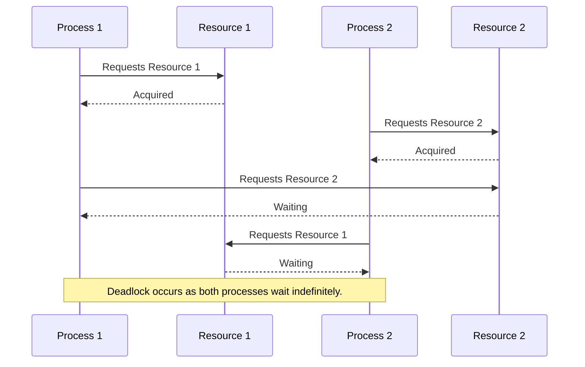

# Deadlocks

A deadlock is a situation in which two or more transactions or processes are unable to proceed because each is waiting for the other to release a resource, resulting in a standstill. This can occur in various computing environments, including databases, operating systems, and concurrent programming. Here’s a detailed explanation of deadlocks:

## Deadlock Conditions

For a deadlock to occur, the following four conditions must be present simultaneously:

1. **Mutual Exclusion**:
   - Only one process can hold a resource at a time. If another process requests the same resource, it must wait until the resource is released.

2. **Hold and Wait**:
   - A process is holding at least one resource and is waiting to acquire additional resources that are currently being held by other processes.

3. **No Preemption**:
   - A resource cannot be forcibly removed from a process holding it; the process must release the resource voluntarily.

4. **Circular Wait**:
   - A set of processes are waiting for each other in a circular chain. Each process is waiting for a resource held by the next process in the chain.

## Example of a Deadlock

Consider two transactions, T1 and T2, in a database system:

- **Transaction T1** locks Resource R1 and waits to lock Resource R2.
- **Transaction T2** locks Resource R2 and waits to lock Resource R1.

Here, T1 cannot proceed because it is waiting for R2, which is held by T2. Conversely, T2 cannot proceed because it is waiting for R1, which is held by T1. This situation creates a circular wait, leading to a deadlock.

## Deadlock Detection and Resolution

To handle deadlocks, systems typically use one or more of the following approaches:

1. **Deadlock Prevention**:
   - **Avoidance**: Ensuring that at least one of the necessary conditions for deadlock cannot hold. This might involve designing the system to always allocate resources in a specific order, or to ensure that a process can only request resources when it has none.
   - **Preemption**: Temporarily taking away resources from a process and giving them to another process to break the deadlock cycle.

2. **Deadlock Detection**:
   - The system periodically checks for deadlocks by examining the resource allocation graph. If a cycle is detected, a deadlock exists.

3. **Deadlock Recovery**:
   - **Termination**: One or more processes involved in the deadlock are terminated to break the cycle. The system might choose the process with the lowest cost to restart.
   - **Resource Preemption**: Resources held by deadlocked processes are preempted and allocated to other processes until the deadlock cycle is broken.

## Practical Measures in Databases

- **Timeouts**: Transactions that wait for a resource beyond a certain threshold are rolled back and retried.
- **Deadlock Detection Algorithms**: Techniques such as Wait-for Graphs, where the system detects cycles in the graph representing the processes and their resource requests.
- **Lock Ordering**: Ensuring that all transactions acquire locks in a predefined order to prevent circular wait conditions.

## Conclusion

Deadlocks are a critical issue in concurrent systems that can severely affect performance and reliability. Understanding the conditions that lead to deadlocks and implementing strategies for prevention, detection, and resolution are essential for maintaining system stability and efficiency.