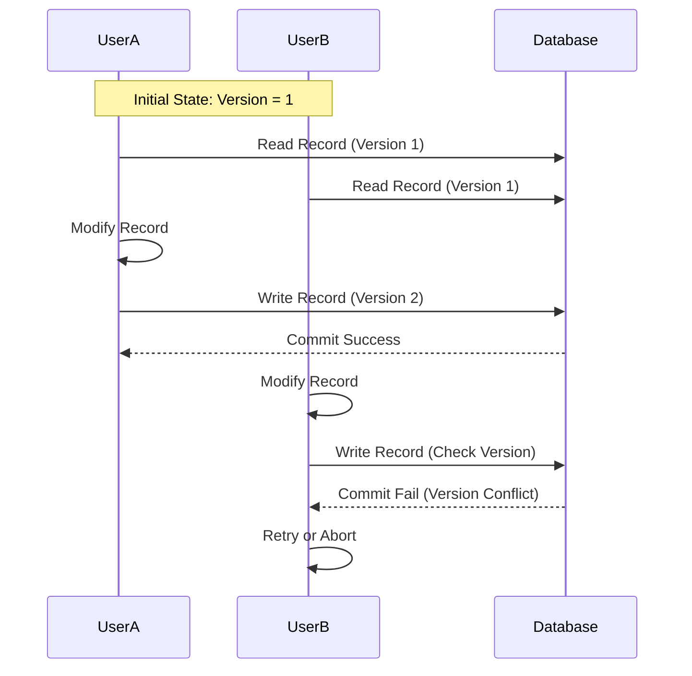

# Optimistic Locking

## Definition

Optimistic locking is a concurrency control mechanism used to manage simultaneous access to data in a database or other shared resource. Unlike pessimistic locking, which locks resources to prevent conflicts, optimistic locking assumes that conflicts are rare and allows multiple transactions to proceed without locking resources. It checks for conflicts only when the data is about to be committed.

## How It Works

1. **Read Phase**:
   - A transaction reads the data and records the current version or timestamp of the data.  
2. **Work Phase**:
   - The transaction performs the required operations (e.g., calculations, updates) without locking the data.
3. **Write Phase**:
   - Before committing the changes, the transaction checks if the data's version or timestamp has changed since it was read.
   - If the version/timestamp is unchanged, the transaction commits the changes.
   - If the version/timestamp has changed (indicating another transaction modified the data), the transaction detects a conflict and must retry or abort.

## Example

Here is a Mermaid diagram to visualize the optimistic locking process:



## Key Characteristics

- **Conflict Detection**: Conflicts are detected only at the commit point, not during the transaction's execution.
- **No Locking**: Resources are not locked during the transaction, which can lead to better performance in scenarios with low conflict rates.
- **Retries**: If a conflict is detected, the transaction may need to be retried, which can add overhead.

## Advantages and Disadvantages of Optimistic Locking

| **Aspect**       | **Advantages**                                                                                   | **Disadvantages**                                                                                    |
|------------------|--------------------------------------------------------------------------------------------------|------------------------------------------------------------------------------------------------------|
| **Concurrency**  | - Improved concurrency by allowing multiple transactions to proceed simultaneously without locks. | - In high-conflict scenarios, frequent retries can degrade performance.                              |
| **Deadlocks**    | - Reduced risk of deadlocks, as resources are not locked.                                        | - More complex implementation, requiring versioning and conflict detection logic.                    |
| **Performance**  | - Better performance in scenarios with low conflict rates due to the absence of lock management. | - Potential overhead due to the need for transactions to check versions and potentially retry.       |
| **Simplicity**   | - Simplifies resource management by avoiding the need for locks.                                 | - Can be less efficient than pessimistic locking if conflicts are frequent and retries are common.    |
| **Throughput**   | - Higher throughput by allowing more transactions to be processed concurrently.                  | - Requires careful handling of retries to ensure data consistency and avoid excessive resource use.   |

## Real-World Use Cases

- **E-commerce**: Managing inventory where updates to stock levels are infrequent but critical.
- **Collaboration Tools**: Allowing multiple users to edit documents simultaneously, with conflict resolution handled at save time.
- **Financial Systems**: Handling transactions where multiple updates to accounts are processed concurrently, with checks to ensure consistency.

## Example in C#

Here's a simple example of how optimistic locking might be implemented in a C# application using Entity Framework:

```csharp
public class Product
{
    public int Id { get; set; }
    public string Name { get; set; }
    public int Quantity { get; set; }
    [Timestamp]
    public byte[] RowVersion { get; set; }
}

public void UpdateProductQuantity(int productId, int newQuantity)
{
    using (var context = new MyDbContext())
    {
        var product = context.Products.Find(productId);
        if (product != null)
        {
            product.Quantity = newQuantity;

            try
            {
                context.SaveChanges();
            }
            catch (DbUpdateConcurrencyException)
            {
                // Handle the concurrency conflict
                // For example, reload the entity and inform the user about the conflict
                var entry = context.Entry(product);
                entry.OriginalValues.SetValues(entry.GetDatabaseValues());
                // Retry logic or user notification here
            }
        }
    }
}
```

In this example, the `RowVersion` property is used for optimistic concurrency control. The `Timestamp` attribute ensures that the version is checked during updates, and any conflict will throw a `DbUpdateConcurrencyException`.

## Summary

Optimistic locking is a technique that enhances concurrency and performance by allowing multiple transactions to proceed without locking resources, assuming conflicts are infrequent and resolving them only at commit time. It is particularly effective in environments with low conflict rates, providing better throughput and reducing deadlocks compared to pessimistic locking.
