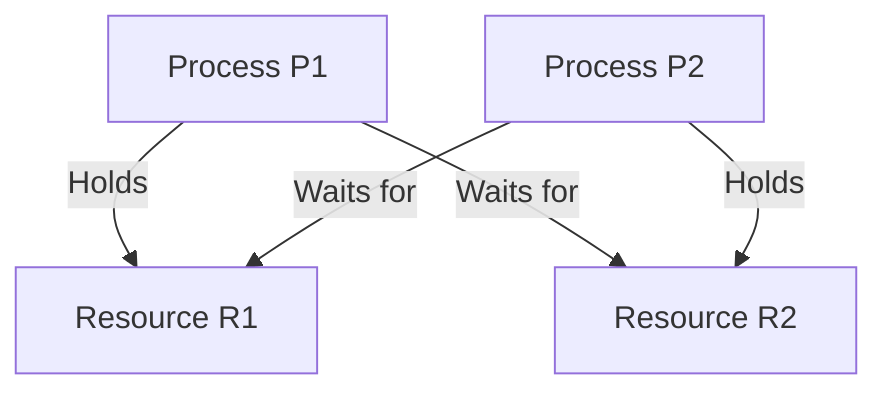

# Learning Guide: Deadlocks

- [Learning Guide: Deadlocks](#learning-guide-deadlocks)
  - [Introduction](#introduction)
  - [Key Concepts](#key-concepts)
  - [Causes of Deadlocks](#causes-of-deadlocks)
  - [Deadlock Prevention and Avoidance](#deadlock-prevention-and-avoidance)
  - [Detection and Recovery](#detection-and-recovery)
  - [Examples](#examples)
    - [Example of a Deadlock Situation](#example-of-a-deadlock-situation)
    - [Code Example (C#)](#code-example-c)
  - [Mermaid Diagram](#mermaid-diagram)
  - [Summary](#summary)

## Introduction

A deadlock is a situation in computing where two or more processes are unable to proceed because each is waiting for the other to release a resource. Understanding deadlocks is crucial for writing robust concurrent applications.

## Key Concepts

- **Processes**: Independent programs that execute concurrently.
- **Resources**: Items required by processes to perform tasks (e.g., memory, files).
- **Wait Condition**: A process waiting for a resource held by another process.

## Causes of Deadlocks

Deadlocks can occur due to the following conditions:

1. **Mutual Exclusion**: At least one resource is held in a non-sharable mode.
2. **Hold and Wait**: Processes holding resources are allowed to request additional resources.
3. **No Preemption**: Resources cannot be forcibly taken from a process.
4. **Circular Wait**: A circular chain of processes exists, each waiting for a resource held by the next.

## Deadlock Prevention and Avoidance

1. **Prevention**: Ensure that at least one of the necessary conditions for deadlock cannot hold. For example, disallowing hold and wait by requiring processes to request all resources at once.
2. **Avoidance**: Use algorithms like the Banker's Algorithm to allocate resources dynamically and avoid unsafe states.

## Detection and Recovery

- **Detection**: Periodically check for deadlocks by examining resource allocation graphs.
- **Recovery**: Once detected, a deadlock can be resolved by terminating one or more processes or preempting resources.

## Examples

### Example of a Deadlock Situation

Consider two processes, P1 and P2, and two resources, R1 and R2.

1. Process P1 holds Resource R1 and waits for Resource R2.
2. Process P2 holds Resource R2 and waits for Resource R1.

This circular wait creates a deadlock, as neither process can proceed.

### Code Example (C#)

```csharp
public class Resource
{
    public readonly object Lock1 = new object();
    public readonly object Lock2 = new object();
}

public void Process1(Resource resource)
{
    lock (resource.Lock1)
    {
        Thread.Sleep(100); // Simulating work
        lock (resource.Lock2) // Potential deadlock if Process2 holds Lock2
        {
            // Critical section
        }
    }
}

public void Process2(Resource resource)
{
    lock (resource.Lock2)
    {
        Thread.Sleep(100); // Simulating work
        lock (resource.Lock1) // Potential deadlock if Process1 holds Lock1
        {
            // Critical section
        }
    }
}
```

## Mermaid Diagram



## Summary

Deadlocks are a critical issue in concurrent programming that can lead to system unresponsiveness. By understanding their causes and implementing prevention, avoidance, and detection strategies, developers can create more robust applications that handle concurrency effectively.
