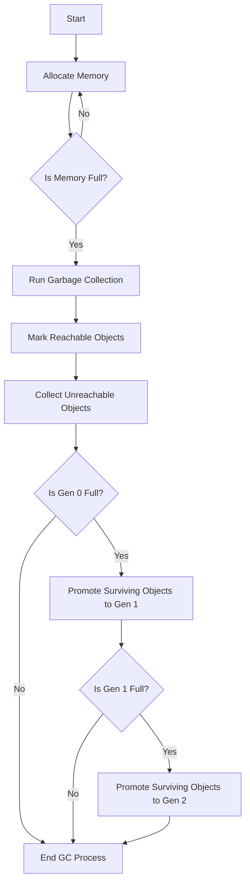

# Learning Guide: Garbage Collection

- [Learning Guide: Garbage Collection](#learning-guide-garbage-collection)
  - [Introduction](#introduction)
  - [Key Concepts](#key-concepts)
  - [How Garbage Collection Works](#how-garbage-collection-works)
  - [Generational Approach](#generational-approach)
    - [Garbage Collection Process Diagram](#garbage-collection-process-diagram)
  - [Types of Garbage Collection](#types-of-garbage-collection)
  - [Example of Garbage Collection in C#](#example-of-garbage-collection-in-c)
  - [Advantages and Disadvantages](#advantages-and-disadvantages)
    - [Advantages](#advantages)
    - [Disadvantages](#disadvantages)
  - [Summary](#summary)

## Introduction

Garbage collection is an automatic memory management process that reclaims memory occupied by objects that are no longer in use, preventing memory leaks and optimizing resource utilization.

## Key Concepts

- **Managed Memory**: Memory that is handled by the garbage collector rather than the programmer.
- **Memory Leak**: A situation where allocated memory is not released, leading to reduced available memory over time.

## How Garbage Collection Works

Garbage collection typically operates in the following phases:

1. **Mark Phase**: The garbage collector identifies which objects in memory are still in use (reachable) by traversing references.
2. **Sweep Phase**: The collector then reclaims the memory occupied by objects that are not reachable, freeing up space for future allocations.

## Generational Approach

In .NET, the garbage collector categorizes objects into three generations based on their lifespan:

- **Generation 0**: Holds newly allocated objects. The GC runs frequently here since these objects usually have short lifespans.
- **Generation 1**: Contains objects that survive collection from Generation 0. These objects have a longer lifespan but are not as long-lived as those in Generation 2.
- **Generation 2**: Reserved for long-lived objects that survive multiple garbage collections from Generation 1. This generation is collected less frequently.

### Garbage Collection Process Diagram



## Types of Garbage Collection

1. **Reference Counting**: Keeps track of the number of references to each object and deallocates memory when the reference count drops to zero.
2. **Tracing Garbage Collection**: Uses algorithms to identify unreachable objects by tracing from root references (e.g., stack variables) and marking objects accordingly.

## Example of Garbage Collection in C#

In C#, garbage collection is handled by the .NET runtime. Here’s a simple example:

```csharp
class Program
{
    static void Main()
    {
        CreateObjects();
        // At this point, the objects created in CreateObjects are no longer referenced
    }

    static void CreateObjects()
    {
        var obj1 = new MyClass();
        var obj2 = new MyClass();
        // obj1 and obj2 go out of scope after this method exits
    }
}

class MyClass
{
    // Some properties and methods
}
```

In this example, once `CreateObjects` completes, `obj1` and `obj2` are no longer referenced, making them eligible for garbage collection.

## Advantages and Disadvantages

### Advantages
- **Automatic Memory Management**: Reduces the burden on developers to manually manage memory.
- **Prevention of Memory Leaks**: Helps in identifying and reclaiming memory from unused objects.

### Disadvantages
- **Performance Overhead**: Garbage collection can introduce pauses in application execution, affecting performance.
- **Non-deterministic Timing**: The timing of garbage collection is not predictable, which can complicate performance tuning.

## Summary

Garbage collection is an essential feature in modern programming languages that enhances memory management by automatically reclaiming unused memory. Understanding how it works can help developers write more efficient code and avoid common pitfalls associated with manual memory management.
