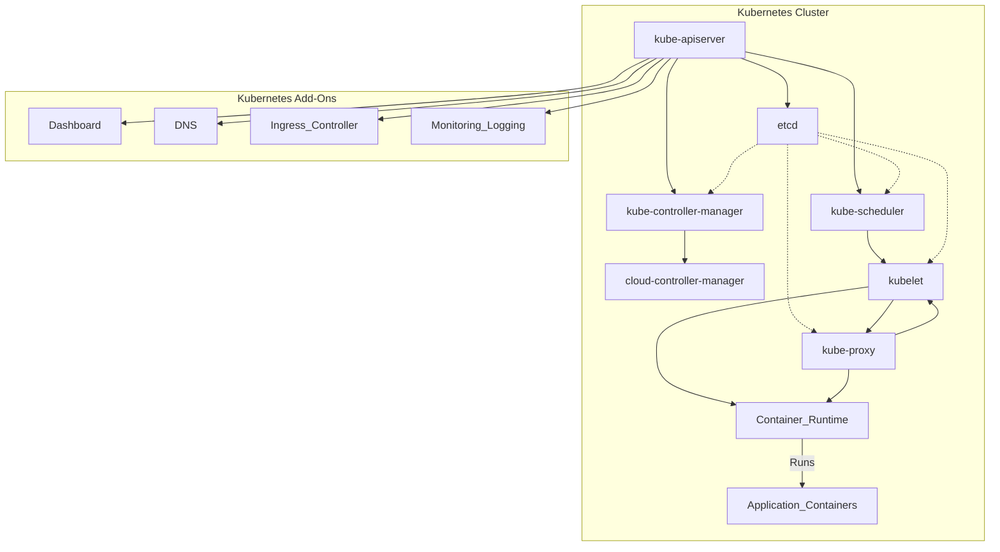

# Kubernetes (K8s) Components

Kubernetes (K8s) is an open-source container orchestration platform designed to automate the deployment, scaling, and management of containerized applications. It comprises several key components, each serving a specific purpose in the Kubernetes ecosystem.

## Master Components

1. **kube-apiserver**: The API server is the central management entity that exposes the Kubernetes API, which clients interact with to control the cluster. It validates and configures data for the API objects, manages authentication, and serves the Kubernetes REST API.

2. **etcd**: etcd is a distributed key-value store that stores all cluster data, including configuration details and cluster state. It provides high availability and consistency and is often used as Kubernetes' backing store.

3. **kube-scheduler**: The scheduler is responsible for assigning pods to nodes based on resource requirements, workload constraints, and other factors. It ensures optimal resource utilization and performance by distributing workloads across the cluster.

4. **kube-controller-manager**: The controller manager runs various controllers that regulate the state of the cluster, such as node and replication controllers. It watches the cluster state through the API server and ensures that the actual state matches the desired state.

5. **cloud-controller-manager**: In cloud-based Kubernetes deployments, the cloud controller manager interacts with the underlying cloud provider's API to manage resources such as load balancers, volumes, and virtual machines. It abstracts cloud-specific functionality from the core Kubernetes codebase.

## Node Components

1. **kubelet**: The kubelet is an agent running on each node in the cluster. It communicates with the API server to manage containers and ensures that containers are running in a pod as specified in their configuration.

2. **kube-proxy**: The kube-proxy is responsible for network proxying and load balancing within the cluster. It maintains network rules and forwards traffic to the appropriate pods based on IP address and port number.

3. **Container Runtime**: Kubernetes supports various container runtimes, such as Docker, containerd, and cri-o, which are responsible for running and managing containers on nodes.

## Add-Ons

1. **DNS**: The Kubernetes DNS add-on provides DNS-based service discovery within the cluster. It assigns DNS names to Kubernetes services, allowing pods to communicate with each other using service names.

2. **Dashboard**: The Kubernetes dashboard is a web-based user interface for managing and monitoring Kubernetes clusters. It provides visibility into cluster resources, deployments, and logs.

3. **Ingress Controller**: An Ingress controller manages external access to services within the Kubernetes cluster. It routes external traffic to the appropriate services based on ingress rules defined by the user.

4. **Monitoring and Logging**: Various monitoring and logging solutions, such as Prometheus, Grafana, and Elasticsearch, can be integrated with Kubernetes to collect metrics, monitor cluster health, and analyze logs.

These components work together to provide a scalable, resilient, and self-healing platform for deploying and managing containerized applications in production environments. Understanding the role of each component is essential for effectively deploying and managing Kubernetes clusters.

## Architecture

