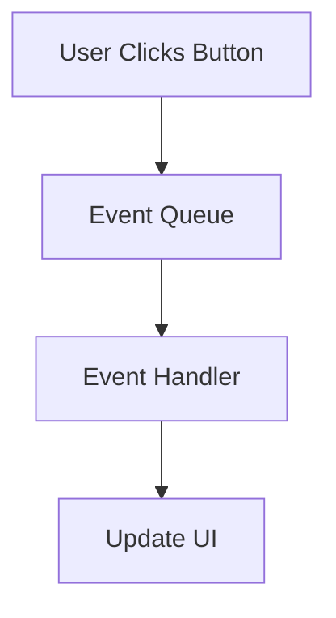
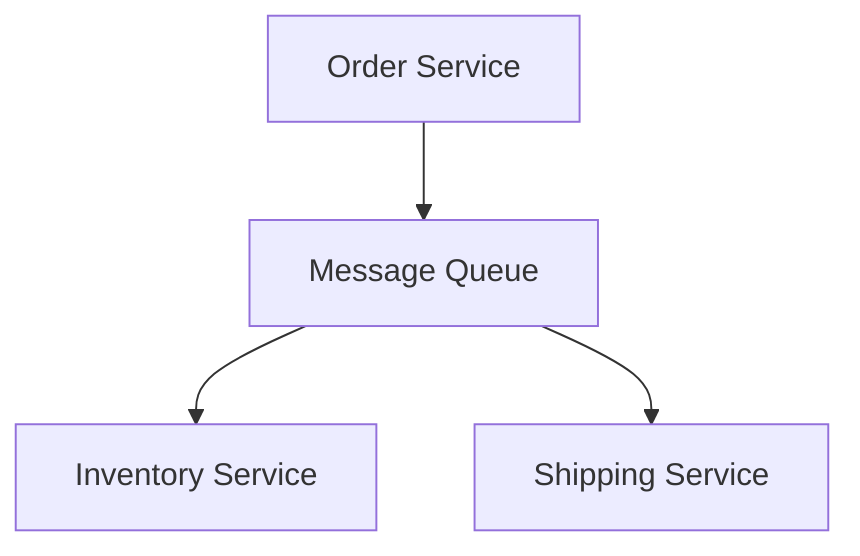

# Learning Guide: Event Queue vs. Message Queue

- [Learning Guide: Event Queue vs. Message Queue](#learning-guide-event-queue-vs-message-queue)
  - [Introduction](#introduction)
  - [Key Concepts](#key-concepts)
  - [Event Queue vs. Message Queue](#event-queue-vs-message-queue)
    - [Event Queue](#event-queue)
    - [Message Queue](#message-queue)
  - [Advantages and Disadvantages](#advantages-and-disadvantages)
  - [Summary](#summary)

## Introduction

Event queues and message queues are both fundamental components in asynchronous communication systems. They play critical roles in decoupling components, improving scalability, and managing distributed workloads.

## Key Concepts

- **Event Queue**: A system that handles events, typically representing state changes or signals generated by systems or user actions.
- **Message Queue**: A system that facilitates communication between distributed components by queuing messages sent from producers to consumers.

## Event Queue vs. Message Queue

| **Aspect**       | **Event Queue**                                  | **Message Queue**                              |
|------------------|--------------------------------------------------|------------------------------------------------|
| **Purpose**      | Handles events that indicate changes or actions | Handles messages to facilitate communication  |
| **Communication**| Typically used for event-driven architectures    | Used for point-to-point or publish-subscribe communication |
| **Data Handling**| Events are often handled by event listeners or handlers | Messages are processed by consumers or handlers |
| **Processing**   | Events are often processed as they occur        | Messages can be stored and processed asynchronously |
| **Use Case**     | User interface events, system state changes      | Task distribution, service communication       |

### Event Queue

**Definition**: An event queue is a data structure or service where events are stored and managed for asynchronous processing. Events are often signals or notifications about occurrences in a system.

**Example Use Case**: In a web application, an event queue might handle user interactions like button clicks or form submissions, where the events trigger specific actions or updates.

**Diagram**:

### Message Queue

**Definition**: A message queue is a middleware component that allows different parts of a distributed system to communicate by sending and receiving messages. It ensures that messages are delivered and processed reliably.

**Example Use Case**: In an e-commerce system, a message queue might manage order processing tasks where the order service sends messages to inventory and shipping services.

**Diagram**:

## Advantages and Disadvantages

| **Aspect**            | **Event Queue**                               | **Message Queue**                              |
|-----------------------|-----------------------------------------------|------------------------------------------------|
| **Advantages**        | Simplifies event handling, supports event-driven systems | Provides reliable messaging, supports asynchronous communication |
| **Disadvantages**     | Can become complex with many events and handlers | Can introduce latency, requires careful design to avoid message loss |

## Summary

Event queues and message queues are essential tools for managing communication in distributed and asynchronous systems. While event queues are ideal for handling system events and user interactions, message queues provide a robust framework for communication between distributed components. Understanding the differences and use cases for each can help in designing scalable and efficient systems.