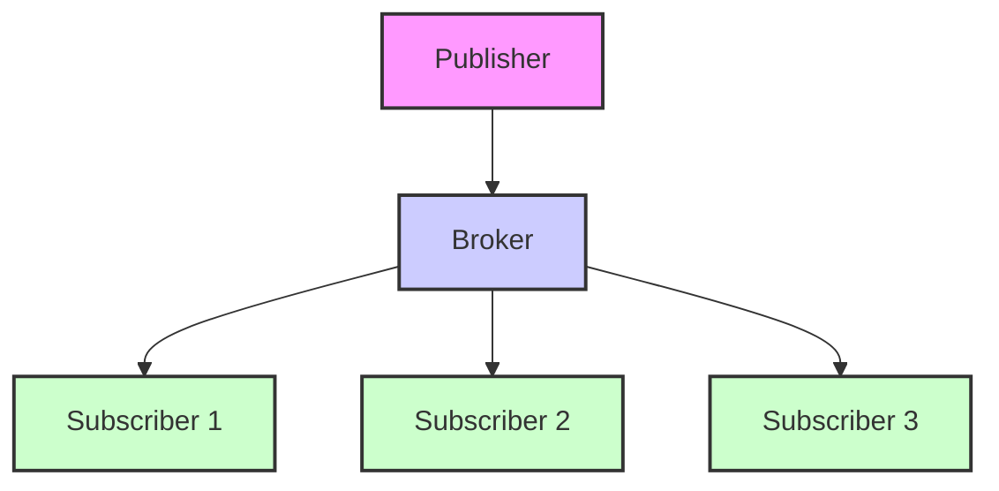

# Learning Guide: Publish/Subscribe

- [Learning Guide: Publish/Subscribe](#learning-guide-publishsubscribe)
  - [Introduction](#introduction)
  - [Key Concepts](#key-concepts)
  - [Publish/Subscribe Pattern](#publishsubscribe-pattern)
    - [Definition](#definition)
    - [Example Use Case](#example-use-case)
    - [Diagram](#diagram)
  - [Advantages and Disadvantages](#advantages-and-disadvantages)
  - [Summary](#summary)

## Introduction

The Publish/Subscribe (Pub/Sub) pattern is a messaging pattern used to manage communication between distributed systems. It decouples producers and consumers of messages, allowing for scalable and flexible communication.

## Key Concepts

- **Publisher**: An entity that produces and sends messages or events.
- **Subscriber**: An entity that receives and processes messages or events.
- **Topic**: A channel or category to which publishers send messages and subscribers subscribe.
- **Broker**: A system that manages the distribution of messages between publishers and subscribers.

## Publish/Subscribe Pattern

### Definition

In the Publish/Subscribe pattern, publishers send messages to a topic without knowing which subscribers will receive them. Subscribers express interest in one or more topics and receive messages related to those topics. This pattern promotes loose coupling between components and allows for easy scaling and maintenance.

### Example Use Case

In a stock trading application, a publisher might send updates about stock prices to a topic. Multiple subscribers, such as user interfaces and analytics services, can subscribe to this topic to receive and process price updates.

### Diagram

## Advantages and Disadvantages

| **Aspect**            | **Advantages**                               | **Disadvantages**                             |
|-----------------------|----------------------------------------------|----------------------------------------------|
| **Decoupling**        | Promotes loose coupling between components  | Can introduce complexity in message routing |
| **Scalability**       | Easily scales with more publishers and subscribers | Can lead to performance issues if not managed properly |
| **Flexibility**       | Allows for dynamic addition or removal of subscribers | Message loss can occur if not properly managed |
| **Maintainability**   | Simplifies system design and maintenance     | Requires a robust broker or message broker system |

## Summary

The Publish/Subscribe pattern is a powerful tool for managing communication in distributed systems. By decoupling publishers and subscribers, it provides flexibility and scalability in message distribution. Understanding how to implement and manage this pattern effectively can lead to more resilient and adaptable systems.
