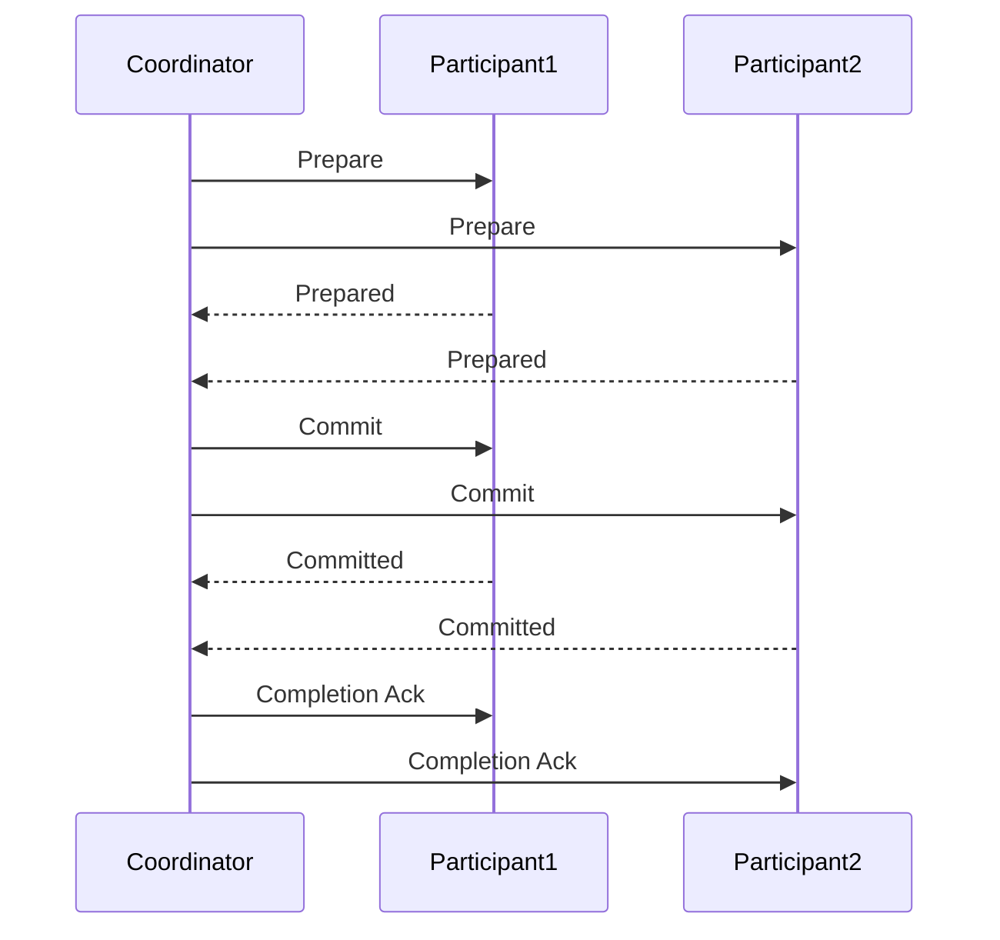

# Learning Guide: N Phase Commit

- [Learning Guide: N Phase Commit](#learning-guide-n-phase-commit)
  - [Introduction](#introduction)
  - [Key Concepts](#key-concepts)
  - [How N Phase Commit Works](#how-n-phase-commit-works)
    - [Preparation Phase](#preparation-phase)
    - [Commit Phase](#commit-phase)
    - [Completion Phase](#completion-phase)
  - [Advantages and Disadvantages](#advantages-and-disadvantages)
  - [Example](#example)
  - [Summary](#summary)

## Introduction

The N Phase Commit protocol is a distributed algorithm used to ensure that all participants in a distributed system agree on a transaction's final outcome. This protocol is essential for maintaining data consistency and integrity across multiple systems.

## Key Concepts

- **Distributed Systems**: Systems where components located on networked computers communicate and coordinate their actions by passing messages.
- **Transaction**: A sequence of operations performed as a single logical unit of work.
- **Commit**: The action of making a transaction's changes permanent.

## How N Phase Commit Works

The N Phase Commit protocol can be broken down into three primary phases: Preparation, Commit, and Completion. Here's a simplified view of the process:



### Preparation Phase

1. The coordinator sends a "prepare" message to all participants.
2. Participants perform necessary checks and return a "prepared" or "abort" response.

### Commit Phase

1. If all participants are prepared, the coordinator sends a "commit" message.
2. Participants commit the transaction and acknowledge the commit.

### Completion Phase

1. The coordinator sends a "completion" acknowledgment to all participants.
2. Participants can now clean up and release resources associated with the transaction.

## Advantages and Disadvantages

| **Aspect**       | **Advantages**                                           | **Disadvantages**                                        |
|------------------|----------------------------------------------------------|----------------------------------------------------------|
| **Consistency**  | Ensures all participants agree on the transaction outcome | Potential for blocking if a participant or coordinator fails |
| **Integrity**    | Maintains data integrity across distributed systems       | Complexity in implementation and resource management |
| **Fault Tolerance** | Can handle participant failures with proper recovery mechanisms | Longer latency due to multiple phases and communication overhead |

## Example

Consider a distributed banking system where a money transfer between two accounts involves multiple participants:

1. The coordinator sends a prepare message to both accounts' databases.
2. Each database checks if the transaction can proceed (e.g., sufficient funds).
3. Both databases return a "prepared" response.
4. The coordinator sends a commit message.
5. Both databases commit the transaction and update their records.
6. The coordinator acknowledges completion to both databases.

```csharp
public class Coordinator
{
    private List<Participant> participants;

    public void PrepareTransaction()
    {
        foreach (var participant in participants)
        {
            participant.Prepare();
        }
    }

    public void CommitTransaction()
    {
        foreach (var participant in participants)
        {
            participant.Commit();
        }
    }

    public void CompleteTransaction()
    {
        foreach (var participant in participants)
        {
            participant.Complete();
        }
    }
}

public class Participant
{
    public void Prepare()
    {
        // Check if the transaction can proceed
    }

    public void Commit()
    {
        // Commit the transaction
    }

    public void Complete()
    {
        // Clean up and release resources
    }
}
```

## Summary

The N Phase Commit protocol is crucial for ensuring data consistency and integrity in distributed systems. By following the preparation, commit, and completion phases, it coordinates transactions across multiple participants, balancing consistency with fault tolerance and resource management. Understanding this protocol is essential for developing robust distributed applications.
