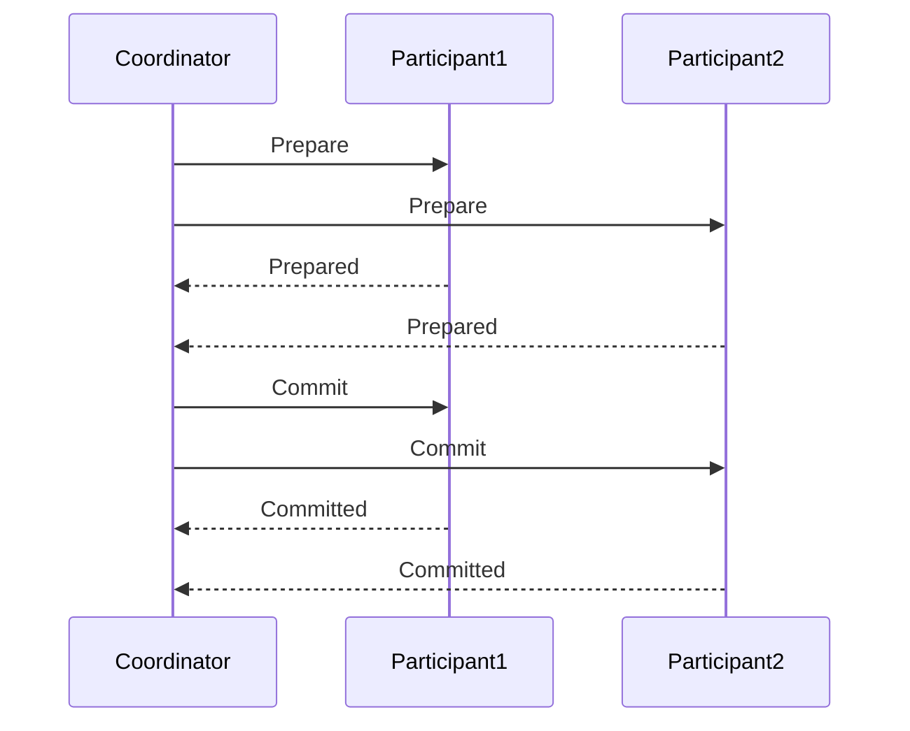

# Learning Guide: Two-Phase Commit

- [Learning Guide: Two-Phase Commit](#learning-guide-two-phase-commit)
  - [Introduction](#introduction)
  - [Key Concepts](#key-concepts)
  - [How Two-Phase Commit Works](#how-two-phase-commit-works)
    - [Preparation Phase](#preparation-phase)
    - [Commit Phase](#commit-phase)
  - [Advantages and Disadvantages](#advantages-and-disadvantages)
  - [Example](#example)
  - [Summary](#summary)

## Introduction

The Two-Phase Commit (2PC) protocol is a distributed algorithm used to ensure all participants in a distributed system agree on a transaction's final outcome. This protocol is essential for maintaining data consistency and integrity across multiple systems.

## Key Concepts

- **Distributed Systems**: Systems where components located on networked computers communicate and coordinate their actions by passing messages.
- **Transaction**: A sequence of operations performed as a single logical unit of work.
- **Commit**: The action of making a transaction's changes permanent.

## How Two-Phase Commit Works

The Two-Phase Commit protocol can be broken down into two primary phases: Preparation and Commit. Here's a simplified view of the process:



### Preparation Phase

1. **Coordinator Sends Prepare Requests**: The coordinator sends a "prepare" message to all participants.
2. **Participants Prepare**: Each participant performs the necessary checks to determine if it can commit the transaction and returns a "prepared" or "abort" response to the coordinator.

### Commit Phase

1. **Coordinator Sends Commit or Abort Requests**: If all participants are prepared, the coordinator sends a "commit" message; if any participant responds with an "abort," the coordinator sends an "abort" message.
2. **Participants Commit or Abort**: Each participant commits the transaction and acknowledges the commit, or aborts the transaction if instructed.

## Advantages and Disadvantages

| **Aspect**       | **Advantages**                                           | **Disadvantages**                                        |
|------------------|----------------------------------------------------------|----------------------------------------------------------|
| **Consistency**  | Ensures all participants agree on the transaction outcome | Potential for blocking if a participant or coordinator fails |
| **Integrity**    | Maintains data integrity across distributed systems       | Complexity in implementation and resource management |
| **Fault Tolerance** | Can handle participant failures with proper recovery mechanisms | Longer latency due to multiple phases and communication overhead |

## Example

Consider a distributed banking system where a money transfer between two accounts involves multiple participants:

1. **Preparation Phase**:
   - The coordinator sends a prepare message to both accounts' databases.
   - Each database checks if the transaction can proceed (e.g., sufficient funds).
   - Both databases return a "prepared" response.

2. **Commit Phase**:
   - If both databases are prepared, the coordinator sends a commit message.
   - Both databases commit the transaction and update their records.
   - The coordinator acknowledges the commit to both databases.

```csharp
public class Coordinator
{
    private List<Participant> participants;

    public void PrepareTransaction()
    {
        foreach (var participant in participants)
        {
            participant.Prepare();
        }
    }

    public void CommitTransaction()
    {
        foreach (var participant in participants)
        {
            participant.Commit();
        }
    }
}

public class Participant
{
    public void Prepare()
    {
        // Check if the transaction can proceed
    }

    public void Commit()
    {
        // Commit the transaction
    }
}
```

## Summary

The Two-Phase Commit protocol is crucial for ensuring data consistency and integrity in distributed systems. By following the preparation and commit phases, it coordinates transactions across multiple participants, balancing consistency with fault tolerance and resource management. Understanding this protocol is essential for developing robust distributed applications.