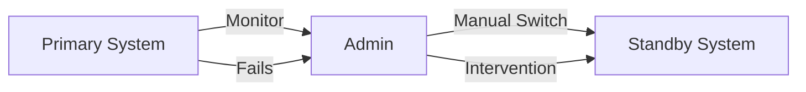

# Learning Guide: Failover Strategies

- [Learning Guide: Failover Strategies](#learning-guide-failover-strategies)
  - [Introduction](#introduction)
  - [Key Concepts](#key-concepts)
  - [Types of Failover Strategies](#types-of-failover-strategies)
    - [Active-Passive](#active-passive)
    - [Active-Active](#active-active)
    - [Manual Failover](#manual-failover)
  - [Advantages and Disadvantages](#advantages-and-disadvantages)
  - [Example](#example)
  - [Summary](#summary)

## Introduction

Failover strategies are essential for ensuring the high availability and reliability of systems. These strategies automatically switch to a standby system or component when the primary system fails, minimizing downtime and maintaining continuous operation.

## Key Concepts

- **Failover**: The process of switching to a standby system when the primary system fails.
- **High Availability**: Ensuring a system is operational and accessible with minimal downtime.
- **Redundancy**: Having additional components or systems in place to take over in case of failure.

## Types of Failover Strategies

### Active-Passive

In an active-passive failover configuration, one system (active) handles all the traffic while another (passive) remains on standby, ready to take over if the active system fails.

```mermaid
graph LR
    A[Primary System (Active)] -- Health Check --> B[Failover System (Passive)]
    A -->|Operational| C[Client Requests]
    B -->|Fails| D[Client Requests]
```

### Active-Active

In an active-active configuration, multiple systems are active and share the load. If one system fails, the remaining systems continue to handle the traffic, balancing the load among them.

```mermaid
graph LR
    A[System 1 (Active)] -- Health Check --> C[Client Requests]
    B[System 2 (Active)] -- Health Check --> C
    C -->|Fails| D[Client Requests] --> A
    D -->|Fails| E[Client Requests] --> B
```

### Manual Failover

Manual failover requires human intervention to switch to the standby system when the primary system fails. This strategy is often used when automatic failover is not feasible or necessary.



## Advantages and Disadvantages

| **Aspect**       | **Advantages**                                           | **Disadvantages**                                        |
|------------------|----------------------------------------------------------|----------------------------------------------------------|
| **Active-Passive** | - Simple to implement<br>- Reduces resource usage           | - Potential downtime during failover<br>- Passive system underutilized     |
| **Active-Active** | - No downtime during failover<br>- Better resource utilization | - More complex to implement<br>- Requires load balancing |
| **Manual Failover** | - Cost-effective for less critical systems<br>- Human oversight in decision making | - Slower failover process<br>- Higher risk of human error |

## Example

Consider a web application using an active-passive failover strategy:

1. The primary system handles all client requests.
2. The failover system regularly checks the health of the primary system.
3. If the primary system fails, the failover system takes over, ensuring minimal downtime.

```mermaid
graph LR
    A[Primary System] -->|Operational| B[Client Requests]
    A -- Health Check --> C[Failover System (Standby)]
    C -->|Primary Fails| B
```

## Summary

Failover strategies are critical for maintaining high availability and reliability in systems. Active-passive, active-active, and manual failover configurations each have their own advantages and disadvantages. Selecting the appropriate strategy depends on the specific requirements and constraints of the system.
