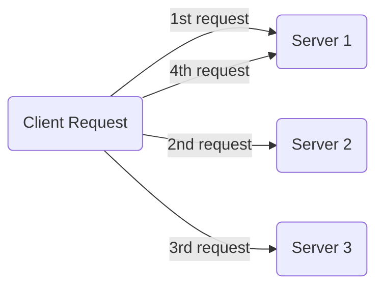
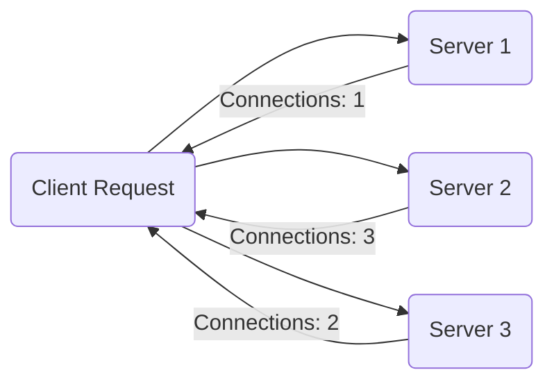
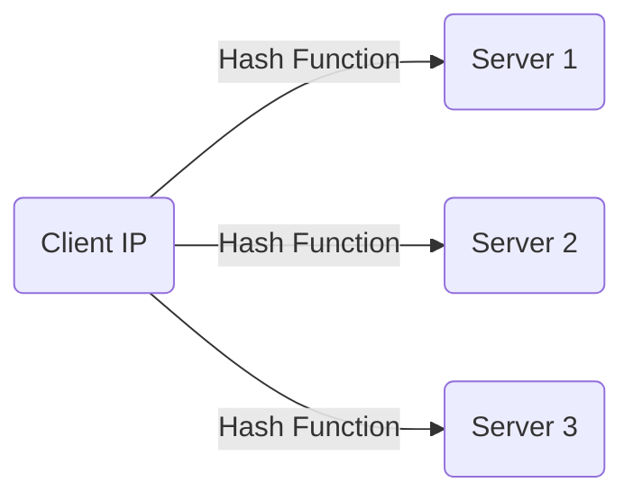
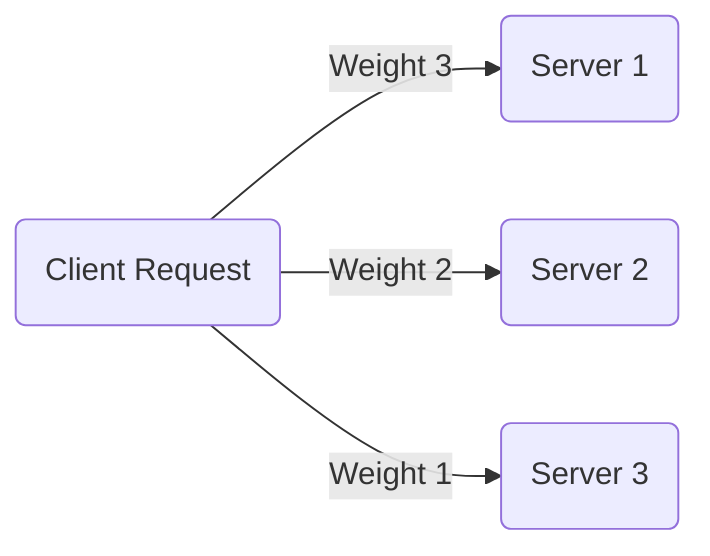
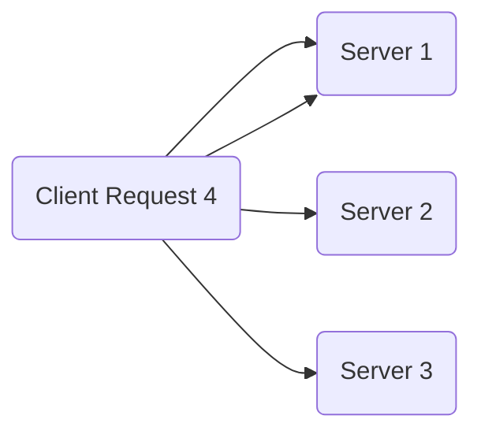

# Learning Guide: Load Balancing

- [Learning Guide: Load Balancing](#learning-guide-load-balancing)
  - [Introduction](#introduction)
  - [Key Concepts](#key-concepts)
  - [Types of Load Balancers](#types-of-load-balancers)
    - [Hardware Load Balancers](#hardware-load-balancers)
    - [Software Load Balancers](#software-load-balancers)
  - [Load Balancing Algorithms](#load-balancing-algorithms)
    - [Round Robin](#round-robin)
    - [Least Connections](#least-connections)
    - [IP Hash](#ip-hash)
    - [Weighted Distribution](#weighted-distribution)
  - [Advantages and Disadvantages](#advantages-and-disadvantages)
  - [Example](#example)
  - [Summary](#summary)

## Introduction

Load balancing is a technique used to distribute network or application traffic across multiple servers. This ensures no single server bears too much demand, improving the availability, reliability, and scalability of a service.

## Key Concepts

- **Load Balancer**: A device or software that distributes incoming network traffic across multiple servers.
- **Server Pool**: A group of servers behind a load balancer that handles requests.
- **High Availability**: Ensuring a service is available with minimal downtime.
- **Scalability**: The ability to handle increased load by adding more resources.

## Types of Load Balancers

### Hardware Load Balancers

Hardware load balancers are physical devices designed specifically for balancing network traffic. They are typically more powerful but can be expensive and less flexible.

### Software Load Balancers

Software load balancers run on standard hardware or virtual machines. They are more flexible, easier to update, and often more cost-effective than hardware load balancers.

## Load Balancing Algorithms

### Round Robin

Distributes requests sequentially across the server pool.

### Least Connections

Routes traffic to the server with the fewest active connections.

### IP Hash

Uses a hash of the client's IP address to determine which server receives the request.

### Weighted Distribution

Assigns requests based on server weights, allowing more powerful servers to handle more traffic.

## Advantages and Disadvantages

| **Aspect**           | **Advantages**                                           | **Disadvantages**                                        |
|----------------------|----------------------------------------------------------|----------------------------------------------------------|
| **Performance**      | - Improves response times by distributing load           | - Potential single point of failure (mitigated by redundancy) |
| **Reliability**      | - Increases availability and uptime                      | - Can introduce complexity in network management         |
| **Scalability**      | - Allows scaling out by adding more servers              | - Requires careful configuration to avoid bottlenecks    |
| **Maintenance**      | - Facilitates easier maintenance and updates             | - Can incur additional costs for hardware or software    |

## Example

Consider a web application with three servers and a load balancer using the round-robin algorithm:

1. The first client request goes to Server 1.
2. The second client request goes to Server 2.
3. The third client request goes to Server 3.
4. The fourth client request goes to Server 1, and so on.

## Summary

Load balancing is a critical technique in modern web applications to ensure high availability, reliability, and scalability. By distributing traffic across multiple servers using various algorithms, load balancers help maintain optimal performance and service continuity.
