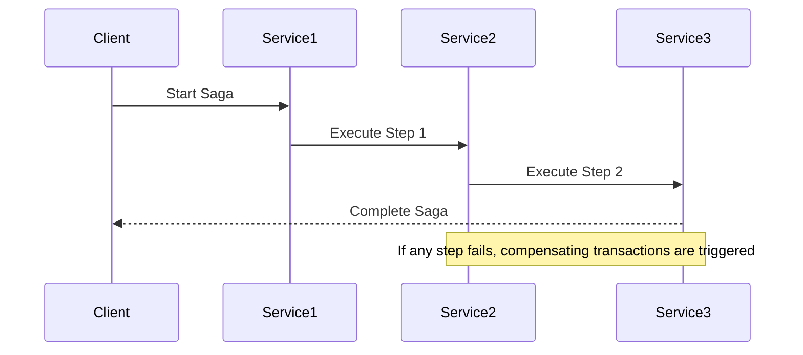

# Learning Guide: Saga Pattern

- [Learning Guide: Saga Pattern](#learning-guide-saga-pattern)
  - [Introduction](#introduction)
  - [Key Concepts](#key-concepts)
  - [Saga Pattern Overview](#saga-pattern-overview)
  - [How the Saga Pattern Works](#how-the-saga-pattern-works)
    - [Example Process](#example-process)
    - [Diagram](#diagram)
  - [Advantages and Disadvantages](#advantages-and-disadvantages)
  - [Example of Saga Pattern](#example-of-saga-pattern)
  - [Summary](#summary)

## Introduction

The Saga Pattern is a design pattern used for managing long-running transactions and complex business processes in distributed systems. It helps maintain consistency across multiple services while handling failures and ensuring reliable execution.

## Key Concepts

- **Saga**: A sequence of transactions or operations that together accomplish a business process.
- **Compensating Transaction**: A transaction that undoes the effects of a previous transaction if it fails.
- **Choreography**: Each service involved in the saga handles its own part of the process and triggers the next service in the sequence.
- **Orchestration**: A central service manages the entire saga, coordinating the sequence of transactions and handling compensations.

## Saga Pattern Overview

The Saga Pattern involves splitting a large transaction into a series of smaller, manageable steps. Each step in the saga updates a specific part of the system and is followed by a compensating transaction if it fails.

## How the Saga Pattern Works

### Example Process

1. **Initiation**: The saga starts with an initial request, triggering the first transaction.
2. **Execution**: Each subsequent transaction is executed sequentially, with each service performing its part of the process.
3. **Compensation**: If any transaction fails, compensating transactions are triggered to revert the changes made by previous transactions.

### Diagram

## Advantages and Disadvantages

| **Aspect**            | **Advantages**                               | **Disadvantages**                             |
|-----------------------|----------------------------------------------|----------------------------------------------|
| **Consistency**       | Ensures data consistency across services    | Complex to implement and manage             |
| **Fault Tolerance**   | Can handle failures gracefully               | Requires careful design of compensating actions |
| **Scalability**       | Supports scalable distributed systems        | Overhead of managing transactions and compensations |
| **Flexibility**       | Adaptable to various types of workflows      | Can become difficult to trace and debug     |

## Example of Saga Pattern

Consider an e-commerce application where placing an order involves multiple services: Inventory Service, Payment Service, and Shipping Service. 

1. **Initiate Order**: The customer places an order, starting the saga.
2. **Reserve Inventory**: Inventory Service reserves the items.
3. **Process Payment**: Payment Service processes the payment.
4. **Ship Order**: Shipping Service ships the order.

If any service fails (e.g., payment processing fails), compensating transactions are executed to undo the actions of previous steps (e.g., releasing reserved inventory).

## Summary

The Saga Pattern is a valuable approach for managing distributed transactions in a reliable and scalable way. By breaking down large processes into smaller transactions and handling failures with compensations, it ensures consistency and robustness in complex systems.
