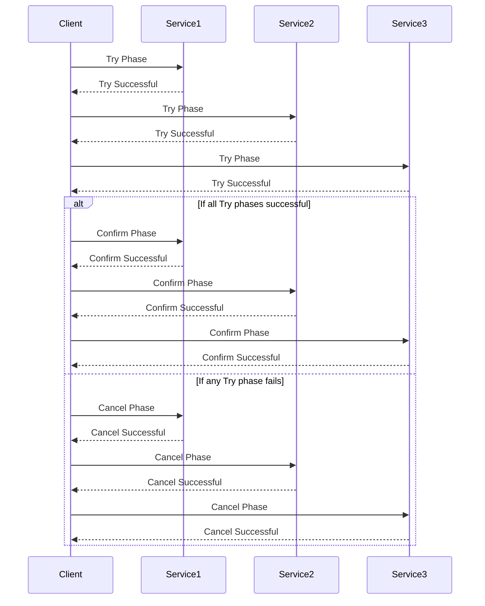

# Learning Guide: TCC (Try-Confirm/Cancel)

- [Learning Guide: TCC (Try-Confirm/Cancel)](#learning-guide-tcc-try-confirmcancel)
  - [Introduction](#introduction)
  - [Key Concepts](#key-concepts)
  - [TCC Overview](#tcc-overview)
  - [How TCC Works](#how-tcc-works)
    - [Example Process](#example-process)
    - [Diagram](#diagram)
  - [Advantages and Disadvantages](#advantages-and-disadvantages)
  - [Example of TCC](#example-of-tcc)
  - [Summary](#summary)

## Introduction

The TCC (Try-Confirm/Cancel) pattern is a design pattern used in distributed systems to manage transactions across multiple services. It is particularly useful for ensuring consistency in systems where transactions span multiple services or databases.

## Key Concepts

- **Try Phase**: Each service performs a preliminary action to prepare for the transaction, ensuring that it can commit or cancel later.
- **Confirm Phase**: If all services successfully complete the Try phase, each service performs the final commit action.
- **Cancel Phase**: If any service encounters a failure, each service executes a rollback action to revert the changes made during the Try phase.

## TCC Overview

The TCC pattern breaks a distributed transaction into three distinct phases, allowing for greater control over the transaction's outcome. This approach helps manage long-running transactions by ensuring that all steps can either complete successfully or be fully rolled back in case of failure.

## How TCC Works

### Example Process

1. **Try Phase**: Each service involved in the transaction performs preliminary actions to prepare for the transaction. For example, reserving inventory or holding funds.
2. **Confirm Phase**: If all Try actions are successful, each service performs the final commit actions to complete the transaction.
3. **Cancel Phase**: If any Try action fails, each service performs rollback actions to undo the changes made during the Try phase.

### Diagram

## Advantages and Disadvantages

| **Aspect**            | **Advantages**                               | **Disadvantages**                             |
|-----------------------|----------------------------------------------|----------------------------------------------|
| **Consistency**       | Ensures data consistency across services    | Requires implementation of compensating actions |
| **Fault Tolerance**   | Can handle failures by rolling back actions | Complex to manage and coordinate            |
| **Isolation**         | Services operate independently in the Try phase | Potential performance overhead due to additional phases |
| **Flexibility**       | Allows for flexible transaction management   | Requires careful design of Try, Confirm, and Cancel operations |

## Example of TCC

Consider a scenario where a customer is placing an order, and the transaction involves Inventory Service, Payment Service, and Shipping Service.

1. **Try Phase**:
   - **Inventory Service**: Reserve the items.
   - **Payment Service**: Hold the payment.
   - **Shipping Service**: Prepare for shipping.

2. **Confirm Phase**:
   - **Inventory Service**: Finalize the reservation.
   - **Payment Service**: Complete the payment.
   - **Shipping Service**: Ship the order.

3. **Cancel Phase** (if any Try phase fails):
   - **Inventory Service**: Release the reserved items.
   - **Payment Service**: Refund the held payment.
   - **Shipping Service**: Cancel the shipping preparation.

## Summary

The TCC (Try-Confirm/Cancel) pattern provides a structured approach to managing distributed transactions. By dividing the transaction into three phases, it ensures that all actions are either completed or fully rolled back, maintaining consistency and reliability in distributed systems. Understanding and implementing TCC can help manage complex transactions across multiple services effectively.
