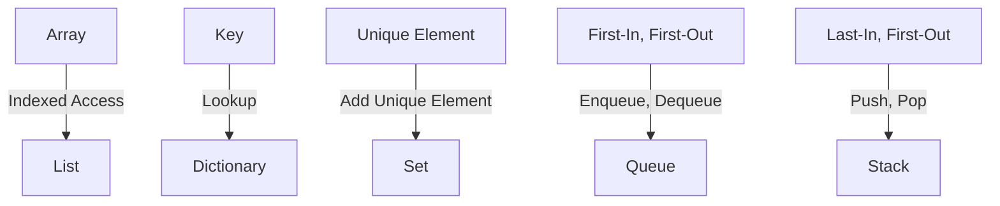

# Learning Guide: Collection Data Structures

- [Learning Guide: Collection Data Structures](#learning-guide-collection-data-structures)
  - [Introduction](#introduction)
  - [Key Concepts](#key-concepts)
  - [Types of Collection Data Structures](#types-of-collection-data-structures)
    - [1. Arrays](#1-arrays)
    - [2. Lists](#2-lists)
    - [3. Dictionaries](#3-dictionaries)
    - [4. Sets](#4-sets)
    - [5. Queues](#5-queues)
    - [6. Stacks](#6-stacks)
  - [Choosing the Right Collection](#choosing-the-right-collection)
  - [Examples](#examples)
    - [Example 1: Using Lists](#example-1-using-lists)
    - [Example 2: Using Dictionaries](#example-2-using-dictionaries)
  - [Visual Representation](#visual-representation)
  - [Summary](#summary)

## Introduction

Collection data structures in C# are fundamental for storing and manipulating groups of related data efficiently. This guide explores various types of collection data structures, their characteristics, and when to use them.

## Key Concepts

- **Data Structure**: A way of organizing data that allows for efficient access and modification.
- **Collection**: A group of objects or values, typically of the same type, managed as a single entity.
- **C# Collections**: Built-in data structures provided by the .NET framework for different needs and scenarios.

## Types of Collection Data Structures

### 1. Arrays

- **Description**: Fixed-size collection of elements of the same type.
- **Use Cases**: When the number of elements is known and doesn't change frequently.

### 2. Lists

- **Description**: Dynamic-size collection that can grow or shrink dynamically.
- **Use Cases**: When the number of elements is not known in advance or varies.

### 3. Dictionaries

- **Description**: Key-value pair collection where each key is unique.
- **Use Cases**: When fast access to data based on a unique identifier (key) is required.

### 4. Sets

- **Description**: Collection of unique elements with no duplicates.
- **Use Cases**: When uniqueness of elements is crucial, such as maintaining a unique list of items.

### 5. Queues

- **Description**: First-in, first-out (FIFO) collection where elements are added at the end and removed from the beginning.
- **Use Cases**: Modeling real-world scenarios like job scheduling or processing tasks in order of arrival.

### 6. Stacks

- **Description**: Last-in, first-out (LIFO) collection where elements are added and removed from the same end.
- **Use Cases**: Reversing the order of items, handling function calls in programming.

## Choosing the Right Collection

- **Considerations**: Efficiency, ease of use, and specific requirements (e.g., order, uniqueness) should guide your choice.
- **Performance**: Each collection type has different performance characteristics for operations like insertion, deletion, and access.

## Examples

### Example 1: Using Lists

```csharp
using System;
using System.Collections.Generic;

public class Program
{
    public static void Main()
    {
        List<string> names = new List<string>();
        
        // Adding elements to the list
        names.Add("Alice");
        names.Add("Bob");
        names.Add("Charlie");
        
        // Iterating through the list
        foreach (var name in names)
        {
            Console.WriteLine(name);
        }
    }
}
```

### Example 2: Using Dictionaries

```csharp
using System;
using System.Collections.Generic;

public class Program
{
    public static void Main()
    {
        Dictionary<int, string> studentGrades = new Dictionary<int, string>();
        
        // Adding elements to the dictionary
        studentGrades.Add(1, "A");
        studentGrades.Add(2, "B");
        studentGrades.Add(3, "C");
        
        // Accessing elements in the dictionary
        Console.WriteLine("Grade of student with ID 2: " + studentGrades[2]);
    }
}
```

## Visual Representation

To visualize how collections work, consider a simple diagram showing how elements are stored and accessed in a list or dictionary.



## Summary

Collection data structures are essential in C# programming for managing and manipulating data efficiently. By understanding the types of collections available and their characteristics, you can make informed decisions about which one to use based on your application's needs.
