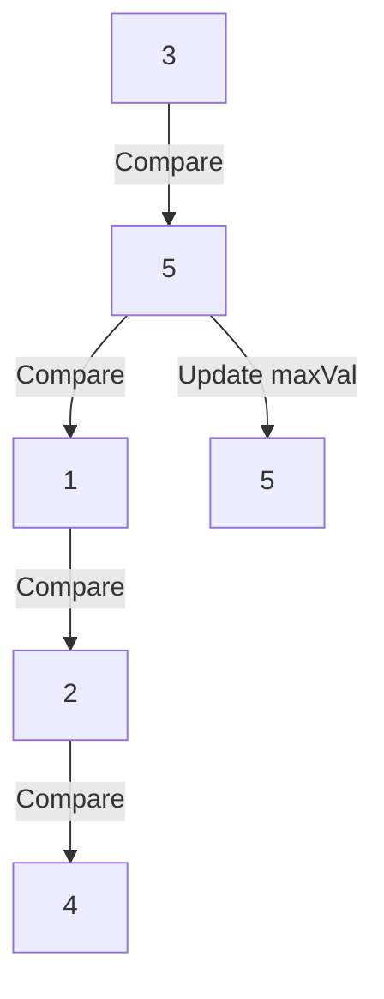

# Learning Guide: Understanding O(n) Notation

- [Learning Guide: Understanding O(n) Notation](#learning-guide-understanding-on-notation)
  - [Introduction](#introduction)
  - [Key Concepts](#key-concepts)
  - [Understanding O(n) with an Example](#understanding-on-with-an-example)
  - [Common Big O Notations](#common-big-o-notations)
  - [Examples](#examples)
  - [Visual Representation](#visual-representation)
  - [Why is it O(n)?](#why-is-it-on)
  - [Quick Recap](#quick-recap)

## Introduction

In this guide, you will learn about O(n) notation, a fundamental concept in computer science used to analyze the efficiency of algorithms in terms of their input size. We'll explore what O(n) notation means and how it applies to practical examples in C#.

## Key Concepts

- **Big O Notation**: Describes the upper bound of the time complexity of an algorithm.
- **Time Complexity**: Measures how the runtime of an algorithm changes with different input sizes.
- **O(n)**: Indicates an algorithm that scales linearly with the input size.

## Understanding O(n) with an Example

Let's use a C# example to find the maximum value in an array.

```csharp
using System;

public class Program
{
    public static int FindMax(int[] arr)
    {
        if (arr == null || arr.Length == 0)
        {
            throw new ArgumentException("Array must have at least one element");
        }

        int maxVal = arr[0]; // Assume the first element is the largest

        for (int i = 1; i < arr.Length; i++)
        {
            if (arr[i] > maxVal)
            {
                maxVal = arr[i]; // Update maxVal if current element is larger
            }
        }

        return maxVal;
    }

    public static void Main()
    {
        int[] numbers = { 3, 5, 1, 2, 4 };
        int maxNumber = FindMax(numbers);
        Console.WriteLine("Maximum number in the array: " + maxNumber);
    }
}
```

## Common Big O Notations

| **Notation**    | **Description**                             | **Example**                                   |
|-----------------|---------------------------------------------|-----------------------------------------------|
| **O(1)**        | Constant time: the runtime does not change with the input size. | Accessing an element in an array by index.   |
| **O(log n)**    | Logarithmic time: the runtime grows logarithmically with the input size. | Binary search in a sorted array.             |
| **O(n)**        | Linear time: the runtime grows linearly with the input size. | Iterating through an array.                  |
| **O(n log n)**  | Linearithmic time: the runtime grows linearly with a logarithmic factor. | Efficient sorting algorithms (e.g., mergesort, heapsort). |
| **O(n^2)**      | Quadratic time: the runtime grows quadratically with the input size. | Nested loops (e.g., bubble sort, selection sort). |
| **O(2^n)**      | Exponential time: the runtime grows exponentially with the input size. | Recursive algorithms solving the Tower of Hanoi. |
| **O(n!)**       | Factorial time: the runtime grows factorially with the input size. | Generating all permutations of a set.        |

## Examples

1. **Constant Time - O(1)**:
   - Accessing an element in an array by its index.

   ```csharp
   int GetFirstElement(int[] array) {
       return array[0]; // Always takes the same amount of time, regardless of array size.
   }
   ```

2. **Logarithmic Time - O(log n)**:
   - Binary search in a sorted array.

   ```csharp
   int BinarySearch(int[] sortedArray, int target) {
       int left = 0;
       int right = sortedArray.Length - 1;
       while (left <= right) {
           int mid = left + (right - left) / 2;
           if (sortedArray[mid] == target) return mid;
           if (sortedArray[mid] < target) left = mid + 1;
           else right = mid - 1;
       }
       return -1; // Element not found
   }
   ```

3. **Linear Time - O(n)**:
   - Iterating through an array.

   ```csharp
   int SumArray(int[] array) {
       int sum = 0;
       for (int i = 0; i < array.Length; i++) {
           sum += array[i];
       }
       return sum;
   }
   ```

4. **Quadratic Time - O(n^2)**:
   - Nested loops, such as in bubble sort.

   ```csharp
   void BubbleSort(int[] array) {
       int n = array.Length;
       for (int i = 0; i < n - 1; i++) {
           for (int j = 0; j < n - i - 1; j++) {
               if (array[j] > array[j + 1]) {
                   // Swap array[j] and array[j + 1]
                   int temp = array[j];
                   array[j] = array[j + 1];
                   array[j + 1] = temp;
               }
           }
       }
   }
   ```

5. **Exponential Time - O(2^n)**:
   - Solving the Tower of Hanoi problem recursively.

   ```csharp
   void TowerOfHanoi(int n, char from_rod, char to_rod, char aux_rod) {
       if (n == 1) {
           Console.WriteLine($"Move disk 1 from rod {from_rod} to rod {to_rod}");
           return;
       }
       TowerOfHanoi(n - 1, from_rod, aux_rod, to_rod);
       Console.WriteLine($"Move disk {n} from rod {from_rod} to rod {to_rod}");
       TowerOfHanoi(n - 1, aux_rod, to_rod, from_rod);
   }
   ```

## Visual Representation

To visualize the algorithm, let's use a Mermaid diagram to show how the array elements are compared to find the maximum value.



## Why is it O(n)?

- **Iteration**: The `FindMax` method iterates through each element in the array exactly once.
- **Comparison**: Each comparison (`if (arr[i] > maxVal)`) is a constant-time operation, `O(1)`.
- **Linear Relationship**: As the number of elements (`n`) in the array increases, the number of comparisons also increases linearly.
- **Time Complexity**: Therefore, the time complexity of the `FindMax` method is `O(n)`.

## Quick Recap

- **Definition**: O(n) notation describes an algorithm that scales linearly with the input size.
- **Example**: Finding the maximum value in an array using C#.
- **Time Complexity**: Each element is processed once, resulting in a linear relationship between input size and time taken.
- **Importance**: Helps in evaluating and optimizing algorithm performance.

By understanding O(n) notation, you can assess algorithm efficiency and make informed decisions when designing and optimizing your C# applications.
