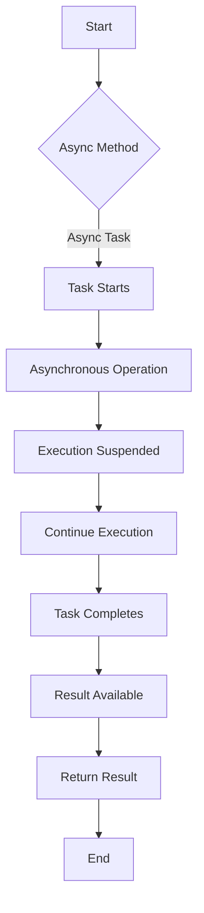

# How async/await Works

Async/await is a language feature in C# that simplifies asynchronous programming by allowing developers to write asynchronous code that looks and behaves like synchronous code. Under the hood, async/await relies on a state machine to manage the asynchronous execution flow. Let's explore how async/await works along with a mermaid activity diagram and details about the state machine.

## Workflow Diagram



1. **Start**: The asynchronous method is invoked.
2. **Async Method**: The method marked as `async` begins execution.
3. **Task Starts**: An asynchronous Task object is returned immediately.
4. **Asynchronous Operation**: The asynchronous operation (e.g., I/O) is initiated, and execution continues asynchronously.
5. **Execution Suspended**: The method execution is suspended, allowing the calling thread to perform other tasks.
6. **Continue Execution**: Once the asynchronous operation completes, execution resumes from the `await` statement.
7. **Task Completes**: The asynchronous Task completes, and the result becomes available.
8. **Result Available**: The result of the asynchronous operation is obtained.
9. **Return Result**: The method returns the result to the caller.
10. **End**: The asynchronous method execution completes.

## State Machine

Async/await utilizes a state machine to manage the asynchronous execution flow. Here's an example of the generated state machine code:

```csharp
private async Task<string> GetDataAsync()
{
    Task<string> task = client.GetStringAsync("https://api.example.com/data");
    StateMachine stateMachine = new StateMachine();
    stateMachine.State = 0;

    while (true)
    {
        switch (stateMachine.State)
        {
            case 0:
                // Start state
                stateMachine.Task = task;
                stateMachine.State = 1;
                break;
            case 1:
                // Asynchronous operation
                if (stateMachine.Task.IsCompleted)
                {
                    stateMachine.Result = await stateMachine.Task;
                    stateMachine.State = 2;
                }
                else
                {
                    // Execution suspended
                    return await stateMachine.Task;
                }
                break;
            case 2:
                // Continuation
                return stateMachine.Result;
        }
    }
}
```

In this example:

- The state machine manages the asynchronous operation's state and execution flow.
- The state machine transitions between states based on the completion of asynchronous tasks and the `await` keyword.
- The generated code ensures that asynchronous operations are performed asynchronously and that execution resumes seamlessly when tasks complete.

Understanding the state machine concept underlying async/await is essential for proficiently leveraging asynchronous programming in C#. By grasping how the state machine manages execution flow and transitions between states, developers can write efficient and maintainable asynchronous code.

## Benefits

1. **Simplified Asynchronous Programming**: Async/await simplifies asynchronous code, making it more readable and maintainable by resembling synchronous code flow.
  
2. **Non-Blocking Execution**: Asynchronous operations do not block the calling thread, allowing it to perform other tasks while waiting for the asynchronous operation to complete.

3. **Improved Performance**: Async/await can improve application responsiveness and scalability by utilizing resources more efficiently, especially in I/O-bound scenarios.

## Considerations

1. **Deadlocks**: Improper use of async/await can lead to deadlocks, especially when blocking on async code or mixing synchronous and asynchronous APIs.

2. **Exception Handling**: Error handling in asynchronous code can be complex, requiring special attention to ensure proper exception propagation and handling.

## Conclusion

Async/await is a powerful feature in C# that simplifies asynchronous programming and improves code readability. By allowing developers to write asynchronous code that resembles synchronous code flow, async/await enhances maintainability and reduces complexity in handling asynchronous operations.

Under the hood, async/await relies on a state machine to manage the asynchronous execution flow. This state machine orchestrates the transition between different states, ensuring that asynchronous operations are performed asynchronously and that execution resumes seamlessly when tasks complete.

Understanding the state machine concept underlying async/await is crucial for proficiently leveraging asynchronous programming in C#. By grasping how the state machine manages execution flow and transitions between states, developers can write efficient and maintainable asynchronous code.

However, developers should also be aware of potential pitfalls, such as deadlocks and complex exception handling, when using async/await. By considering these factors and leveraging the benefits of async/await, developers can harness the full potential of asynchronous programming to build responsive and scalable applications.
