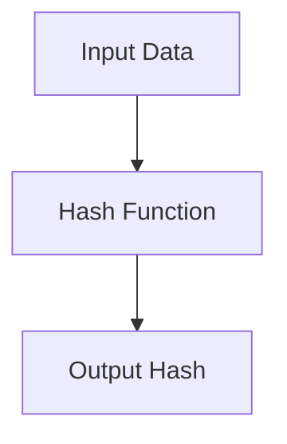

# Learning Guide: Hashing

- [Learning Guide: Hashing](#learning-guide-hashing)
  - [Introduction](#introduction)
  - [Key Concepts](#key-concepts)
  - [How Hashing Works](#how-hashing-works)
  - [Examples](#examples)
    - [Example 1: Hashing with SHA-256 in C#](#example-1-hashing-with-sha-256-in-c)
  - [Common Hash Functions](#common-hash-functions)
  - [Use Cases](#use-cases)
  - [Best Practices](#best-practices)
  - [Summary](#summary)

## Introduction

Hashing is a process that converts input data of any size into a fixed-size string of characters, which is typically a hexadecimal number. It is widely used in computer science for tasks such as data integrity, password storage, and digital signatures.

## Key Concepts

- **Hash Function**: An algorithm that takes an input and produces a fixed-size string of characters.
- **Hash Value (Digest)**: The output of a hash function.
- **Deterministic**: The same input always produces the same hash value.
- **Pre-image Resistance**: It should be infeasible to reverse a hash function (i.e., find the original input from its hash value).
- **Collision Resistance**: It should be infeasible to find two different inputs that produce the same hash value.

## How Hashing Works

1. **Input Data**: Any data you want to hash.
2. **Hash Function**: The data is processed through a hash function.
3. **Output Hash**: A fixed-size string (hash value) is produced.



## Examples

### Example 1: Hashing with SHA-256 in C#

```csharp
using System;
using System.Security.Cryptography;
using System.Text;

public class HashingExample
{
    public static void Main()
    {
        string data = "Sensitive data";
        string hash = ComputeSha256Hash(data);
        Console.WriteLine($"Data: {data}");
        Console.WriteLine($"Hash: {hash}");
    }

    static string ComputeSha256Hash(string rawData)
    {
        using (SHA256 sha256Hash = SHA256.Create())
        {
            byte[] bytes = sha256Hash.ComputeHash(Encoding.UTF8.GetBytes(rawData));
            StringBuilder builder = new StringBuilder();
            for (int i = 0; i < bytes.Length; i++)
            {
                builder.Append(bytes[i].ToString("x2"));
            }
            return builder.ToString();
        }
    }
}
```

## Common Hash Functions

| **Hash Function** | **Description**                                            | **Output Size** |
|-------------------|------------------------------------------------------------|-----------------|
| **MD5**           | Produces a 128-bit hash value, but is considered insecure. | 128 bits        |
| **SHA-1**         | Produces a 160-bit hash value, but is also considered insecure. | 160 bits        |
| **SHA-256**       | Produces a 256-bit hash value, part of the SHA-2 family.   | 256 bits        |
| **SHA-3**         | The latest member of the Secure Hash Algorithm family.     | Variable (224, 256, 384, 512 bits) |

## Use Cases

| **Use Case**               | **Description**                                                   |
|----------------------------|-------------------------------------------------------------------|
| **Data Integrity**         | Verify data has not been altered (e.g., checksums, digital signatures). |
| **Password Storage**       | Store passwords securely by hashing them before saving to a database. |
| **Digital Signatures**     | Verify the authenticity and integrity of digital messages or documents. |
| **Blockchain**             | Ensure data integrity and secure transactions in blockchain technology. |

## Best Practices

| **Practice**                | **Description**                                                                 |
|-----------------------------|---------------------------------------------------------------------------------|
| **Use Secure Hash Functions**| Use strong, secure hash functions (e.g., SHA-256, SHA-3) to avoid vulnerabilities. |
| **Salt Passwords**           | Add a unique salt to each password before hashing to prevent rainbow table attacks. |
| **Regularly Update Algorithms**| Stay updated with current cryptographic standards and migrate to stronger algorithms as needed. |
| **Avoid MD5 and SHA-1**      | These are considered insecure due to vulnerabilities and should be avoided.     |
| **Use Keyed Hashes for Integrity**| Use HMAC (Hash-based Message Authentication Code) to ensure data integrity and authenticity. |

## Summary

Hashing is a fundamental technique in computer science for ensuring data integrity, securely storing passwords, and verifying the authenticity of digital information. By understanding how hashing works and following best practices, you can effectively implement hashing in your applications to enhance security and data integrity.
