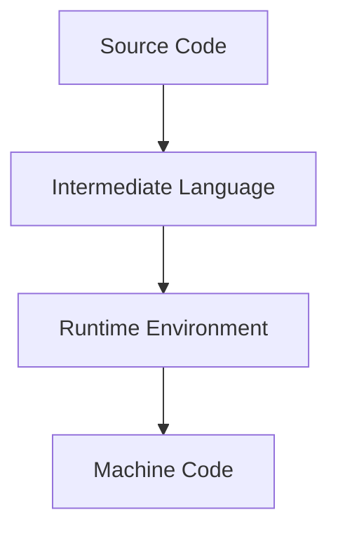

# Learning Guide: Runtimes and Intermediate Languages (e.g., Java, .NET)

- [Learning Guide: Runtimes and Intermediate Languages (e.g., Java, .NET)](#learning-guide-runtimes-and-intermediate-languages-eg-java-net)
  - [Introduction](#introduction)
  - [Key Concepts](#key-concepts)
  - [Java and the JVM](#java-and-the-jvm)
    - [Example](#example)
  - [C# and the .NET Runtime](#c-and-the-net-runtime)
    - [Example](#example-1)
  - [Advantages of Using Intermediate Languages](#advantages-of-using-intermediate-languages)
  - [Mermaid Diagram](#mermaid-diagram)
  - [Summary](#summary)

## Introduction

Runtimes and intermediate languages play a crucial role in modern programming, offering portability and optimization across different platforms.

## Key Concepts

- **Runtime**: An environment where programs are executed.
- **Intermediate Language (IL)**: A low-level code that serves as an intermediary between source code and machine code.

## Java and the JVM

- **Java** is compiled into **Java Bytecode**, an intermediate language.
- **JVM (Java Virtual Machine)** interprets or compiles bytecode into machine code at runtime.

### Example

```java
public class HelloWorld {
    public static void main(String[] args) {
        System.out.println("Hello, World!");
    }
}
```

- Compiled into bytecode (`.class` files) and executed by the JVM.

## C# and the .NET Runtime

- **C#** is compiled into **CIL (Common Intermediate Language)**.
- The **.NET Runtime (CLR - Common Language Runtime)** executes CIL, converting it to native code.

### Example

```csharp
using System;

public class Program {
    public static void Main() {
        Console.WriteLine("Hello, World!");
    }
}
```

- Compiled into CIL and executed by the CLR.

## Advantages of Using Intermediate Languages

- **Portability**: Code can run on any platform with the appropriate runtime.
- **Optimization**: Just-In-Time (JIT) compilation optimizes code execution.
- **Security**: Sandboxed execution environments enhance security.

## Mermaid Diagram



## Summary

Runtimes and intermediate languages, such as Java's JVM and C#'s .NET CLR, provide significant advantages in terms of portability, performance, and security, making them essential components of modern software development.